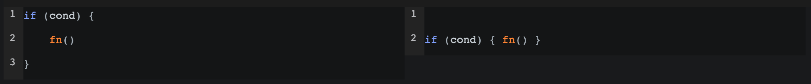
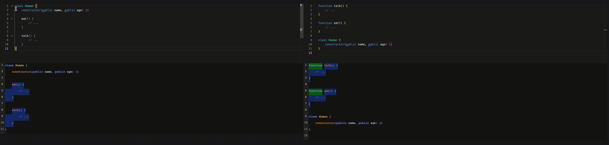
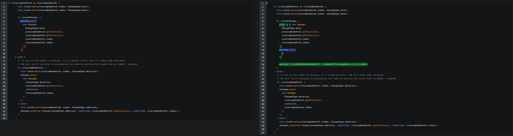

## BetterDiff

This is a _heavily experimental_ tool designed as an alternative to `git diff`, a program used to compare two text files a see the differences between them. 
The tool generates an output that details the differences between the files, which can be viewed either through the included frontend or as text by running it in the CLI. 
In contrast with `git diff` and other existing tools, this project offers:

A novel algorithm: Described brifely bellow, it uses AST nodes as the main data structure
- __Reporting `moves`__: Code that was moved from one place to another get's highlighted in a different color, no more deletion on one side and addition on the other
- __Ignoring trivia changes__: No longer running a code prettifier on a messy file will produce an unreadable diff
- __Programmable__: You can get back the diff result as JSON to implement your own way to display changes
- __Language agnostic__: This project _should_ work with any programming language, more on this bellow

## Showcase 

Ignoring trivia:


Reporting moves:


More complex change:


_For more cases check out the tests under `/tests/conformance`_

## Running it

I will eventually get the time to publish an NPM package, for now the simplest way to run the project locally is to clone it, run `pnpm install`, then you can choose how to run the code

### Running in the CLI

```sh
# Running ts file directly with tsx
tsx ./examples/basic.ts

# OR:

# Start the watch build in one terminal
npm run build

# Run with node
node dist/examples/basic.js
```

### Running the frontend

```sh
# Terminal 1
npm run start

# Terminal 2
npm run ui
```

Default location is `http://localhost:4000/`

## Algorithm

_⚠️Before continuing⚠️_ The algorithm is not final, it has redundant logic (like the two `zigzag` passes) and bugs (crashes due to debug failures or mismatched parenthesis) but the main idea is there.

The main difference between this tool and `git diff` is that it doesn't use [Myers' algorithm](https://www.nathaniel.ai/myers-diff/). Instead, it employs a novel approach summarized as follows:

- Get the AST from the two source files
- Create an array of `Node`, performing a depth-first walk over the AST 
- Create two `Iterator` instances, used to iterate and search nodes in the array
- Start the main loop, attempting to match sequences of nodes (`findBestMatch` fn)
- Iterating over the matches and attempting to align them, if not possible a `move` is created (`processMoves` fn)

After the diff is done we are left with an array of `Change`, with that we can:
  - Apply the changes to the source files to log them in the terminal (`OutputType` `"text"` and `"textPretty"`)
  - Return a more complex data structure to be consumed and displayed by the server (`OutputType` `"serializedOutput"`)

I will create a more detailed explanation of the algorithm later on, for now, the source code is your best resource, I tried to include as many detailed comments as I could.

## Profiling

```
npm run profile
npm run view pprof-time-XX.pb.gz
```

## Benching 

```sh
time git diff ./a.ts ./b.ts > /dev/null
time git diff --patience ./a.ts ./b.ts > /dev/null
# diffstastic
time difft ./a.ts ./b.ts > /dev/null
# betterDiff
time node dist/FILE_NAME.js > /dev/null
```

## Desing considerations

First of all, the `language agnostic` part is theoretical, I still haven't got the time to implement a second language, altohuh using tools like tree-sitter (link) should help us tremendously with this task.
The core logic doesn't ever mention any specific configuration or code path for the given programming language, so _in theory_ you should plug in a parser and it should work.

Similar to [diffstastic](https://github.com/Wilfred/difftastic) this project requires a compiler per programming language (unless one compiler can process more than one programing language, like `swc` or `tsc`), this means that for every new programing language a new parser needs to be configured.

Proper `aligment` is the biggest missing part, this makes reviewing diffs a bit confusing. This is the main feature I'm working on right now.

## Note on ignoring trivia

Ignoring trivia is not something you can do unforgivably, in Javascript, for example, there is something known as Automatic semicolon insertion (ASI), which basically means that if you don't use a semicolon the engine will insert one on your behalf, this makes the following two code snippets behave differently

```js
function getNum() {
  return 1
}

// Returns 1

function getNum() {
  return
  1
}

// Returns undefined
```

This is because a semicolon is automatically inserted after the return keyword

```js
function getNum() {
  return; // !
  1
}

```

In Python spacing is even more important, in determining the scope of the code. 

_Right now_ the project straight up ignores trivial, but there is an issue up to track this feature [here](https://github.com/ElianCordoba/better-diff/issues/25)

This is one of the reasons why this project is far from production ready :)

## Related project

You should also check out the [diffstastic](https://github.com/Wilfred/difftastic) project too! 